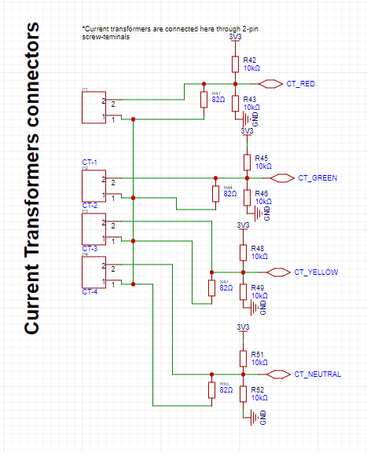

# 3-phase-power-meter-STM32-CJ
3-phase power metering with STM32F4

### Design specification
- 3-phase power
    - 415V phase voltage 
    - 240V line voltage 
    - Three wires (R,Y,B)
- Measure line current 
- Measure line voltage
- STM32F401CCU6
- 12-bit Unipolar ADC 
- ADC Ref Voltage 3.3V
- SSD1306 OLED display screen
- Non-Intrusive measurement 
- No galvanic isolation

### Designed schematic 
#### CPU


#### Current measurement


#### Voltage measurement


### Power calculation
The total power for the 3-phase system is given by:

``` P = SQRT(3) * V_LINE * I_LINE * POWER_FACTOR ```

Where power factor is between 0 and 1, depending on the quality of the supply. 
Please note that this design does not provide power factor correction algorithm or hardware.

### Choice of measurement components 
#### Current measurement
Current measurement is done using a current transformer. The current is transformed by the secondary transformer, passed through a burden resistor and sampled by the STM32 ADC. 

The current transformer used here is the CT1275-A1-RC. It has a turns ratio of 1:2500. It can measure a MAX input current of 100A and give an output of 40mA. 

The output current is transformed to voltage using a burden resistor, then this voltage is sampled and measured by the ADC.  

Calculations were as follows:
To get the burder resistor, I used the following formula: 

```
Rburden = Peak voltage / CT output = 3.3V/40mA = 82.5 mOhm standard = 82 Ohm
```

We need to add a bias voltage to shift this up to 1.65V mid defore feeding to STM32 ADC.

Below shows the circuit for this purpose:


The current transformers are conneted on the phase lines , where the phase line passes through the current transformer.

Here's the link to the project :
https://u.easyeda.com/join?type=project&key=e6ed463bb0bcfe54d6addecaed85d314&inviter=dd1664aa981942349eac2c5b2c113172

#### Voltage measurement 
Line voltage measurement is done using the ZMPT101B voltage transformer. From the datasheet of ZMPT101B, the rated voltage is 240V, and at this voltage, 2mA can be produced on the output.
Having this info, the following calculations were done:

Limiting resistor calculation
```
R'(limiting resistor) = V/I  
I = 2mA from datasheet, for Vl > 220V
R = (240V)/(2mA) = 120kOhm
```

Sampling resistor calculation

```
Rs = (Voutput) / I = [(Voutput max) / V input max]*R'

Vadc max = 3.3V
Vout max rms = 3.3 / 2.(sqrt(2)) =  1.16V

Voutput max = 1.16V 
R' = 120kOhm
Rs = [1.16 / 240] * 120000
Rs = 580R
```

These values were then used to design the circuit below:


### Sampling and ADC measurement
STM32 is a 3.3V 12-bit unipolar ADC. Using this the current and voltage measurement circuits above had to be within this range. So DC biasing method using a potential divider is provided. The circuit is shown below.  
This circuit sets the voltage midpoint to around 1.65V when the current or voltage sensor is not measuring any value. 

### Power calculation 
3-phase power is calculated as follows: 
Assuming balanced 3-phase system, the formula for real(ACTIVE) power is:
```
Power = sqrt(3) * Line voltage * line current * power factor
```

### OLED Display 
I used the SSD1306 display for this task. This display uses 12C communication with the MCU. To carry out the connection, I initialized the I2C channel 2 on the STM and linked it with the display.
I2C for the screen is used in fast mode 

### Firmware 
The firmware follows the following procedure for this meter:
#### 1. Initialize all hardware 
#### 2. Sample the phase voltage 
```c
/**
 * Read voltage from an ADC channel
 */
uint32_t readADC_Voltage(uint32_t CHANNEL) {
	ADC_CH_Cfg.Channel = CHANNEL;
	HAL_ADC_ConfigChannel(&hadc1, &ADC_CH_Cfg);

	HAL_ADC_Start(&hadc1);
	HAL_ADC_PollForConversion(&hadc1, HAL_MAX_DELAY);
	return HAL_ADC_GetValue(&hadc1);
}
....
uint32_t red_curr = readADC_Current(ADC_CHANNEL_5);
uint32_t green_curr = readADC_Current(ADC_CHANNEL_6);
uint32_t yellow_curr = readADC_Current(ADC_CHANNEL_7);
uint32_t neutral_curr = readADC_Current(ADC_CHANNEL_8);

```
#### 3. Sample the phase current

```c
/**
 * Read current from an ADC channel
 */
uint32_t readADC_Current(uint32_t CHANNEL) {

	ADC_CH_Cfg.Channel = CHANNEL;
	HAL_ADC_ConfigChannel(&hadc1, &ADC_CH_Cfg);

	HAL_ADC_Start(&hadc1);
	HAL_ADC_PollForConversion(&hadc1, HAL_MAX_DELAY);
	return HAL_ADC_GetValue(&hadc1);
}


...

uint32_t red_voltage = readADC_Voltage(ADC_CHANNEL_2);
uint32_t green_voltage = readADC_Voltage(ADC_CHANNEL_3);
uint32_t yellow_voltage = readADC_Voltage(ADC_CHANNEL_4);


```

#### 4. Calculate the AC ACTIVE power 
Here I assumed the system is a balanced 3-Phase system:
```c
// calculate the ACTIVE power
// get average values - ASSUMING BALANCED SYSTEM
uint32_t v_line_votlage_avg = (red_voltage + green_voltage + yellow_voltage) / 3;
uint32_t v_line_current_avg = (red_curr + green_curr + yellow_curr + neutral_curr) / 4;

char power_buff[7];
uint32_t total_power = sqrt(3) * v_line_avg * v_line_current_avg;  // assume power factor
sprintf(power_buff, "%d", total_power);


```

#### 5. Display these values on the screen 
Screen used here is teh OLED SSD1306 I2C screen.  
I used blocking code here. This can and should be improved to non-blocking, or use Free RTOS tasks to perfom the reading. Here's the code: 

```c

SSD1306_GotoXY(5, 0);
SSD1306_Puts("R-Ph(V):", &Font_11x18, 1);
SSD1306_GotoXY(15, 5);
SSD1306_Puts(red_voltage_buff, &Font_11x18, 1);

// green phase voltage
SSD1306_GotoXY(5, 0);
SSD1306_Puts("G-Ph(V):", &Font_11x18, 1);
SSD1306_GotoXY(15, 5);
SSD1306_Puts(green_voltage_buff, &Font_11x18, 1);

// yellow phase voltage
SSD1306_GotoXY(5, 0);
SSD1306_Puts("Y-Ph(V):", &Font_11x18, 1);
SSD1306_GotoXY(15, 5);
SSD1306_Puts(yellow_voltage_buff, &Font_11x18, 1);
SSD1306_Clear();

HAL_Delay(2000); // TODO: MAKE THIS NON-BLOCKING

// display line currents
// red phase voltage
SSD1306_GotoXY(5, 0);
SSD1306_Puts("R-Ph(I):", &Font_11x18, 1);
SSD1306_GotoXY(15, 5);
SSD1306_Puts(red_curr_buff, &Font_11x18, 1);

// green phase voltage
SSD1306_GotoXY(5, 0);
SSD1306_Puts("G-Ph(I):", &Font_11x18, 1);
SSD1306_GotoXY(15, 5);
SSD1306_Puts(green_curr_buff, &Font_11x18, 1);

// yellow phase voltage
SSD1306_GotoXY(5, 0);
SSD1306_Puts("Y-Ph(I):", &Font_11x18, 1);
SSD1306_GotoXY(15, 5);
SSD1306_Puts(yellow_curr_buff, &Font_11x18, 1);
SSD1306_Clear();

// yellow phase voltage
SSD1306_GotoXY(5, 0);
SSD1306_Puts("N-Ph(I):", &Font_11x18, 1);
SSD1306_GotoXY(15, 5);
SSD1306_Puts(neutral_curr_buff, &Font_11x18, 1);
SSD1306_Clear();

HAL_Delay(2000); // TODO - MAKE THIS NON-BOCKING

// display the calculated active power
SSD1306_GotoXY(5, 0);
SSD1306_Puts("Power:", &Font_11x18, 1);
SSD1306_GotoXY(15, 5);
SSD1306_Puts(power_buff, &Font_11x18, 1);
SSD1306_Clear();

```

### Conclusion 
All deliverables met